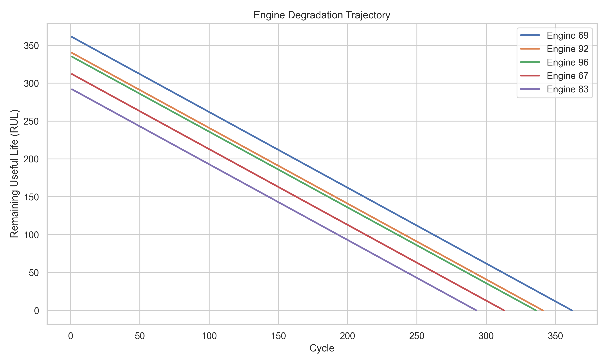
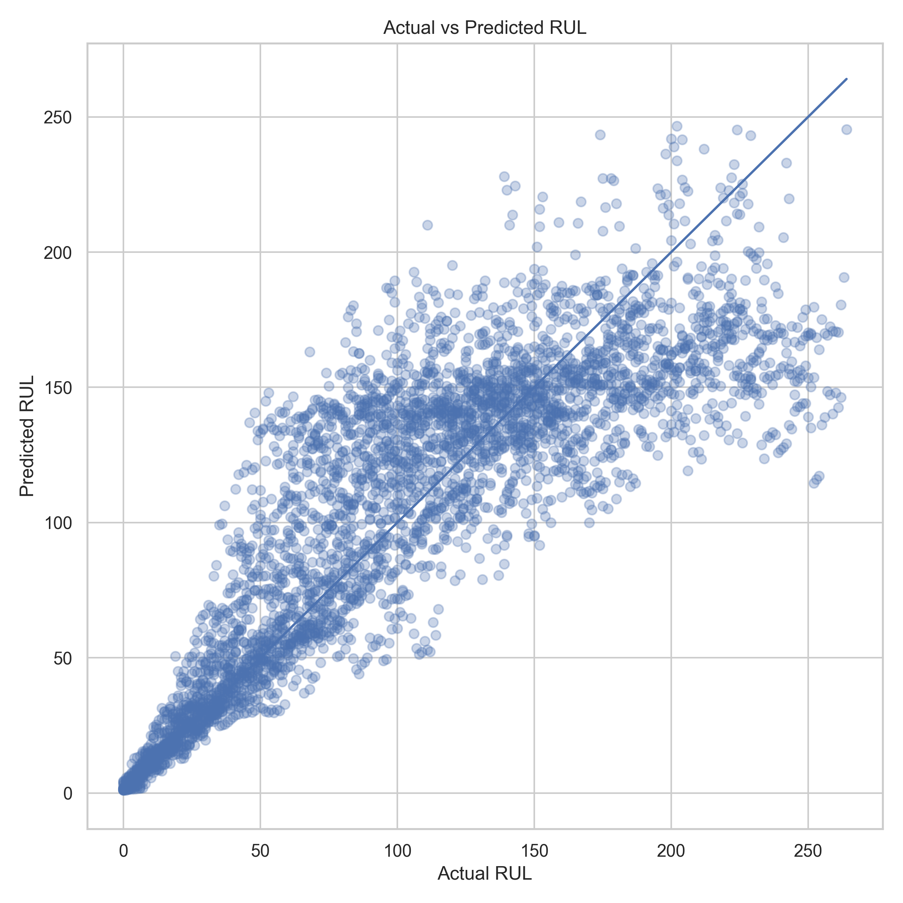

# Aircraft Engine Predictive Maintenance
### Remaining Useful Life (RUL) Prediction using NASA CMAPSS FD001

This project demonstrates a predictive maintenance workflow for aircraft engines by estimating **Remaining Useful Life (RUL)** from NASA **CMAPSS turbofan engine sensor data** and translating predictions into **fleet maintenance priorities**.

---

## Project Overview

Aircraft engines generate large volumes of telemetry data from multiple sensors. Predicting **Remaining Useful Life (RUL)** allows maintenance teams to:

- anticipate component failures
- schedule maintenance proactively
- reduce unexpected downtime
- prioritize engines requiring urgent inspection

This project builds a baseline predictive maintenance model using the NASA **CMAPSS turbofan engine degradation dataset**, focusing on the **FD001 subset**.

---

## Engine Degradation Behavior

The dataset simulates the degradation trajectory of turbofan engines as they approach failure.



Understanding degradation patterns helps identify early warning signals before engine failure.

---

## Feature Engineering

To capture degradation dynamics, the following features were created:

- rolling mean
- rolling standard deviation
- first differences
- lifecycle features

These features summarize both **sensor behavior** and **degradation trends over time**.

---

## Model

A **RandomForest regression model** was used as a baseline model to predict engine Remaining Useful Life.

RandomForest was selected because:

- it handles nonlinear relationships effectively  
- it performs well on tabular engineered features  
- it is robust to noisy sensor signals  
- it provides a strong and interpretable baseline

---

## Model Performance

Model performance was evaluated using **Root Mean Squared Error (RMSE)**.

| Dataset | RMSE |
|--------|------|
| Validation | 33.47 |
| Test | 34.63 |

Prediction results:



The model captures degradation patterns and provides reasonable baseline RUL estimates.

---

## Fleet Maintenance Prioritization

Predicted RUL values can be translated into maintenance priorities across a fleet of aircraft engines.


This demonstrates how predictive maintenance models support **operational maintenance planning**.

Example logic:

```
if predicted_RUL < threshold:
    schedule_maintenance
else:
    continue_operation
```

---

## Repository Structure

```
boeing-predictive-maintenance/
│
├── aircraft_sensor_analysis.ipynb
├── outputs/
│   └── figures/
├── reports/
│   └── predictive_maintenance_report.html
└── README.md
```

---

## Quick Start

Open the notebook:

```
aircraft_sensor_analysis.ipynb
```

View the final report:

```
reports/predictive_maintenance_report.html
```

Generated figures are located in:

```
outputs/figures/
```

---

## Future Improvements

Possible extensions include:

- testing gradient boosting models (XGBoost / LightGBM)
- experimenting with sequence models such as LSTM
- estimating prediction uncertainty
- extending the pipeline to additional CMAPSS subsets

---

## Technologies Used

- Python
- pandas
- NumPy
- scikit-learn
- matplotlib
- seaborn
- Quarto

---

## Author

Hyunwoo Jeong  
GitHub: https://github.com/jeonghyunwoo
