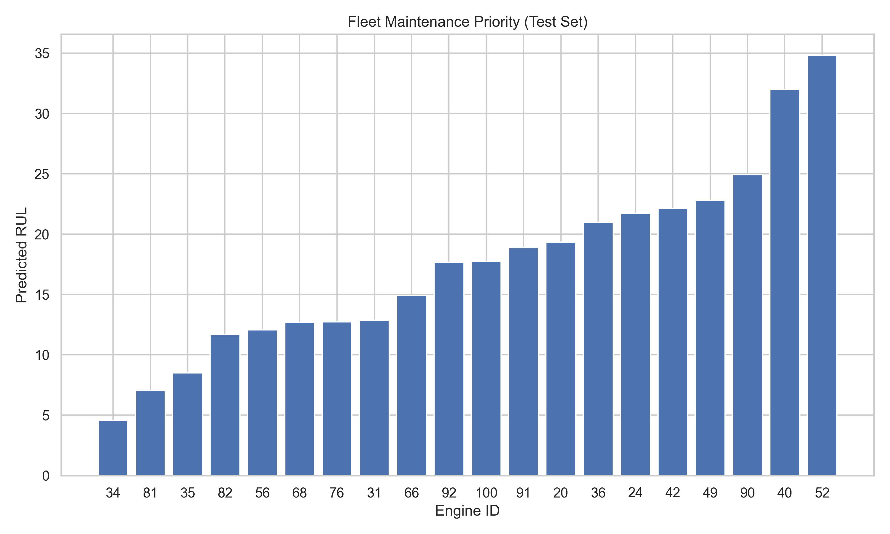
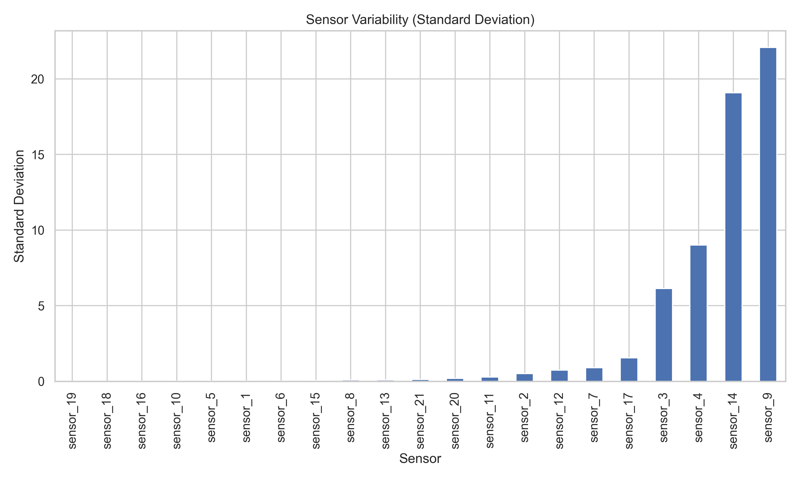
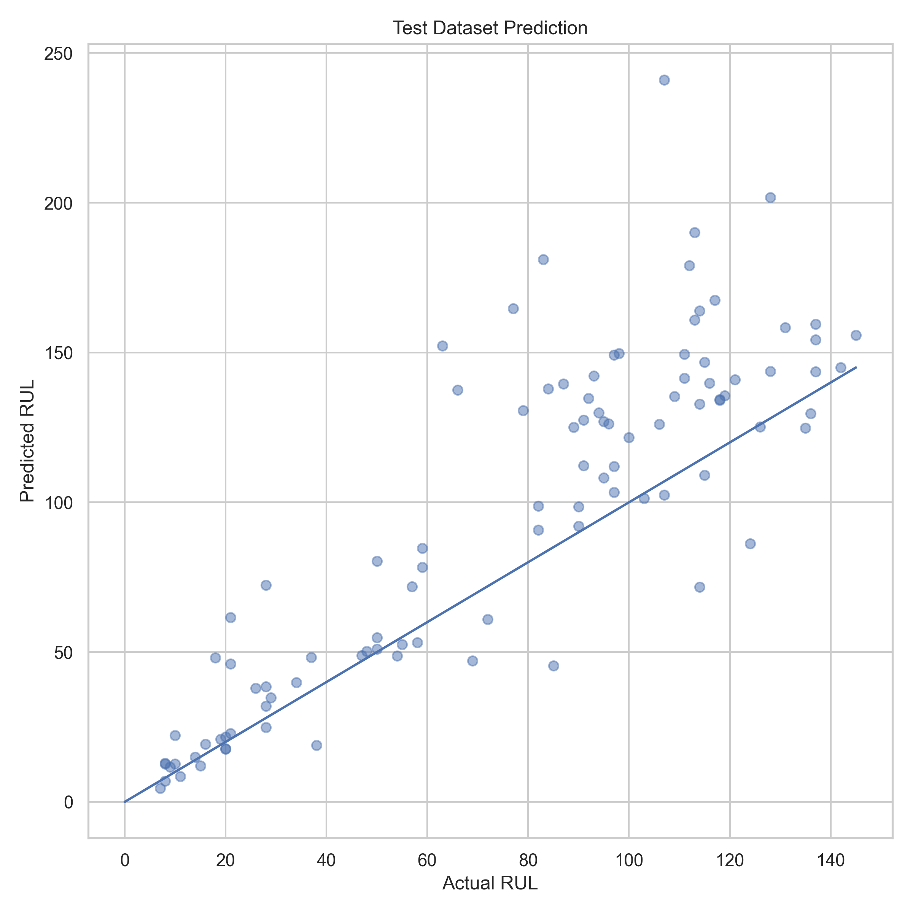
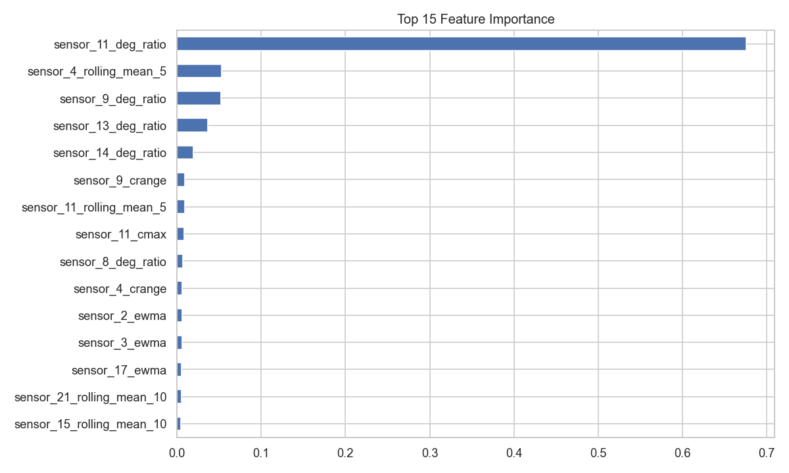
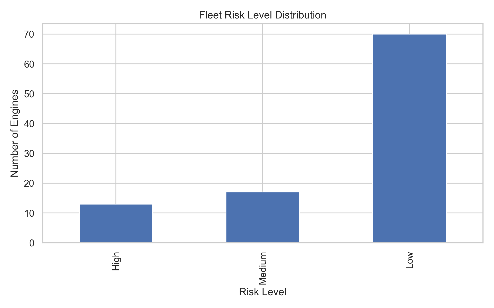

# Aircraft Engine Predictive Maintenance



**Predicting Remaining Useful Life (RUL) using NASA CMAPSS Dataset**

This repository presents an end-to-end predictive maintenance pipeline for aircraft engines using multivariate time-series sensor data.

The project demonstrates how machine learning can transform raw sensor signals into actionable maintenance decisions, including fleet-level maintenance prioritization.

The workflow includes exploratory data analysis, feature engineering for degradation signals, model training, test-set evaluation, and operational interpretation of model outputs.

---

# Project Objective

Aircraft engine failures are rare but costly events that can cause significant operational disruption.

Predictive maintenance aims to estimate the **Remaining Useful Life (RUL)** of engines using sensor telemetry so that maintenance can be scheduled proactively.

This project builds a machine learning pipeline to:

* estimate engine RUL from sensor data
* evaluate prediction performance on unseen engines
* translate predictions into **fleet maintenance prioritization**

---

# Dataset

The project uses the **NASA CMAPSS turbofan engine degradation simulation dataset**.

Dataset characteristics:

* multiple engine degradation trajectories
* 21 sensor measurements
* 3 operational settings
* target variable: Remaining Useful Life (RUL)

Each engine operates normally before gradually degrading until failure.

Dataset reference:
NASA Prognostics Center – CMAPSS Dataset

---

# Workflow

## 1. Exploratory Data Analysis

Sensor data was analyzed to identify signals related to engine degradation.

Key analyses included:

* sensor variability analysis
* correlation between sensors and RUL
* degradation trajectories across engines
* sensor correlation structure

Example visualization:



---

## 2. Feature Engineering

Raw sensor readings were transformed into degradation-aware features.

Feature types:

* rolling mean
* rolling standard deviation
* first differences

These features capture short-term trends and degradation dynamics in sensor behavior.

---

## 3. Model Training

A **RandomForest regression model** was used as the baseline predictive model.

Key design choices:

* engine-level validation to prevent trajectory leakage
* feature engineering applied consistently to train and test data
* model trained on degradation-related sensor features

---

## 4. Model Performance

Model predictions were evaluated on both validation and official CMAPSS test data.

Performance metrics:

* Validation RMSE: **33.47**
* Test RMSE: **34.63**

Prediction accuracy visualization:



---

## 5. Feature Importance

Model interpretation reveals which sensor signals contribute most strongly to RUL prediction.



These results highlight sensors that carry strong degradation signals.

---

## 6. Fleet Maintenance Prioritization

Predicted RUL values were converted into fleet-level maintenance priorities.

Engines with the lowest predicted RUL are considered highest maintenance risk.


Fleet risk distribution:



This step demonstrates how predictive models can support operational maintenance planning.

---

# Project Report

A detailed HTML report generated using **Quarto** is available in:

```
reports/predictive_maintenance_report.html
```

The report summarizes the full analytical workflow and visual results.

---

# Repository Structure

```
.
├─ aircraft_sensor_analysis.ipynb
├─ eda/
│  ├─ sensor_eda.R
│  └─ sensor_eda.qmd
├─ outputs/
│  └─ figures/
├─ reports/
│  ├─ predictive_maintenance_report.qmd
│  └─ predictive_maintenance_report.html
├─ src/
├─ README.md
└─ .gitignore
```

---

# Key Takeaways

This project demonstrates how predictive maintenance models can convert raw telemetry data into operational insights.

Key outcomes:

* degradation-aware feature engineering for sensor data
* machine learning-based RUL prediction
* evaluation on unseen engines
