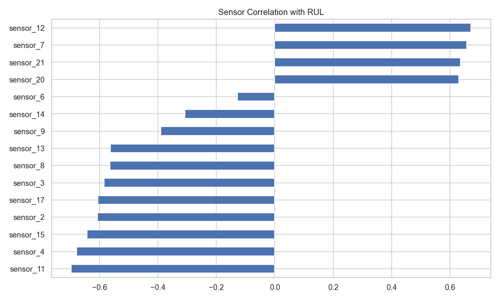

# Project Overview

This project builds a predictive maintenance pipeline for aircraft engines using the NASA CMAPSS dataset.

The objective is to estimate Remaining Useful Life (RUL) and prioritize fleet maintenance.

---

# Dataset

NASA CMAPSS turbofan engine degradation dataset.

- 21 sensor measurements
- Multiple engine degradation trajectories
- Target: Remaining Useful Life (RUL)

---

# Sensor Variability

Sensors with near-zero variance were removed to reduce noise.

---

# Sensor Correlation with RUL

Certain sensors show strong correlation with engine degradation.

---

# Engine Degradation Trajectory

Each engine follows a degradation trajectory until failure.

---

# Model Performance

RandomForest model performance on validation data.

---

# Test Dataset Prediction

Model predictions on unseen engines.

Test RMSE ≈ **34.6**

---

# Feature Importance

Rolling statistics and sensor changes were important predictors.

---

# Fleet Maintenance Prioritization

Engines are ranked by predicted RUL.

Lower RUL indicates higher maintenance priority.

---

# Fleet Risk Distribution

Risk levels are categorized into:

- High risk
- Medium risk
- Low risk

---

# Key Insight

The predictive maintenance model enables proactive fleet management by identifying engines that require early maintenance.

This approach can reduce unexpected failures and improve operational safety.

---

# Future Work

- Hyperparameter tuning
- Gradient boosting models
- Real-time sensor monitoring
- LLM-generated maintenance reports
